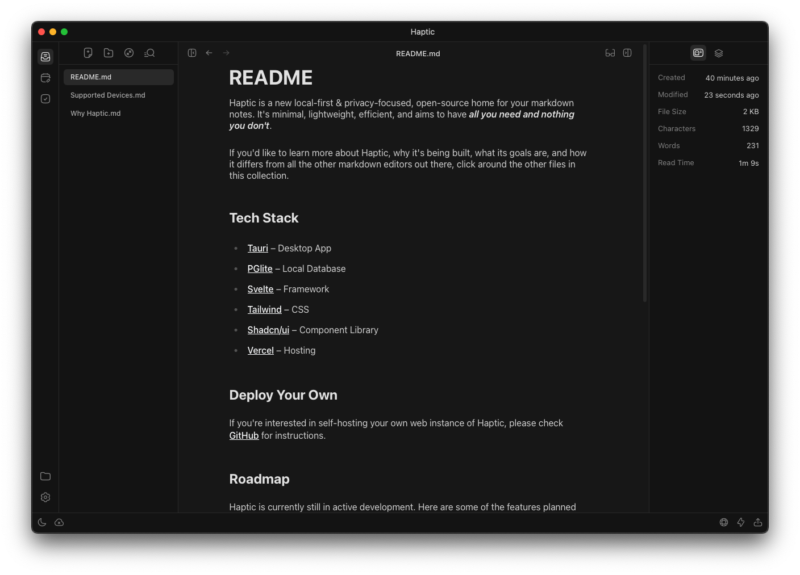

<!-- Header -->
<div align="center" style="margin-top: 120px">
  <a href="https://typyst.md/app">
    
  </a>

  <h3 align="center">Typyst
  </h3>
  <b>
    Open-Source markdown editor - your new home for notes
  </b>
</div>

<!-- TOC -->
<p align="center">
    <a href="https://typyst.md"><strong>Learn more »</strong></a>
    <br />
    <br />
    <a href="https://github.com/chroxify/typyst/tree/main#introduction">Introduction</a>
    ·
    <a href="https://github.com/chroxify/typyst/tree/main#tech-stack">Tech Stack</a>
    ·
    <a href="https://github.com/chroxify/typyst/tree/main#deploy-your-own">Deploy Your Own</a>
    ·
    <a href="https://github.com/chroxify/typyst/tree/main#roadmap">Roadmap</a>
    ·
    <a href="https://github.com/chroxify/typyst/tree/main#contributing">Contributing</a>
  </p>
</p>

<p>
    <a href="https://typyst.md/app">
      <picture>
        <source media="(prefers-color-scheme: dark)" srcset="./.github/assets/typyst-dark.png">
        <source media="(prefers-color-scheme: light)" srcset="./.github/assets/typyst-light.png">
        
      </picture>
    </a>
</p>

## Introduction

Typyst is a new local-first & privacy-focused, open-source home for your markdown notes. It's minimal, lightweight, efficient and aims to have _all you need and nothing you don't_.

If you'd like to learn more about Typyst, why it's being built, what its goals are and how it differs from all the other markdown editors out there, you can read more about it [here](https://typyst.md/app).

## Tech Stack

- [Tauri](https://tauri.app/) – Desktop App
- [PGlite](https://pglite.dev/) – Local Database
- [Svelte](https://kit.svelte.dev/) – Framework
- [Tailwind](https://tailwindcss.com/) – CSS
- [Shadcn/ui](https://www.shadcn-svelte.com/) – Component Library
- [Vercel](https://vercel.com/) – Hosting

## Deploy Your Own

If you're interested in self-hosting your own web instance of Typyst, you can do so with these two options:

### Vercel

You can one-click deploy your own instance of Typyst on Vercel. Just click the button below and follow the instructions:

[](https://vercel.com/new/clone?repository-url=https://github.com/chroxify/typyst&project-name=typyst-web&repository-name=typyst-web&root-directory=apps/web)

### Docker

1. Pull the image from the docker hub

```bash
docker pull chroxify/typyst-web:latest
```

2. Run the container

```bash
docker run -d -p 3000:80 chroxify/typyst-web:latest
```

3. Visit `http://localhost:3000` in your browser

## Roadmap

Typyst is currently still in active development. Here are some of the features planned for the future:

- [ ] Typyst Sync - Sync your notes across devices
- [ ] Note sharing - Share single notes or entire collections via link
- [ ] Mobile support for the web app - Currently dependent on PGlite support for mobile
- [ ] Native mobile apps for iOS & Android
- [ ] Windows & Linux support for the desktop app

and much much more, so stay tuned!

## Contributing

We would love to have your help in making typyst better!

Here's how you can contribute:

- [Report a bug](https://github.com/chroxify/typyst/issues/new?labels=bug) you found while using Typyst
- [Request a feature](https://github.com/chroxify/typyst/issues/new?labels=enhancement) that you think will be useful
- [Submit a pull request](https://github.com/chroxify/typyst/pulls) if you want to contribute with new features or bug fixes

## License

Typyst is licensed under the [GNU Affero General Public License Version 3 (AGPLv3)](https://github.com/chroxify/typyst/blob/main/LICENSE).

---
