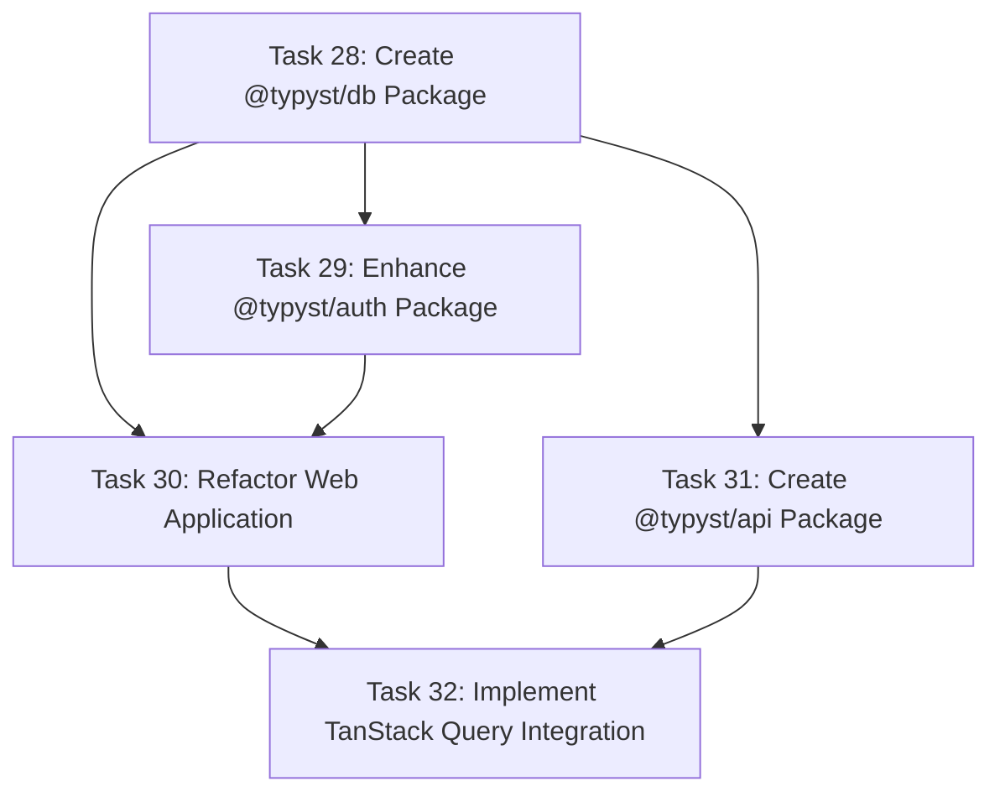

# Type Safety Refactoring Tasks

This directory contains the detailed task breakdown for implementing end-to-end type safety and code reusability in the Odyssey codebase. These tasks are based on the specification document in `specs/type-safety.md`.

## Overview

The refactoring focuses on the web application (`apps/app`) and aims to:
- Establish a single source of truth for database schemas and API contracts
- Centralize authentication and database logic into shared packages
- Implement a reactive, type-safe data layer using TanStack Query
- Prepare for future API integration while maintaining local-first architecture

## Task Dependencies

## Tasks

### Task 28: Create @typyst/db Package with Dual-Database Architecture
**Status:** Not Started  
**Priority:** High  
**Dependencies:** None  

Create a centralized database package that provides typed database clients and schemas while respecting the dual-database architecture (Supabase for auth + PGLite for app data).

**Key Deliverables:**
- Package structure with auth and app schema separation
- Typed database client factories for both Supabase and PGLite
- Proper TypeScript sub-path exports
- Migration of existing schema files

**File:** [task-28-create-typyst-db-package.md](./task-28-create-typyst-db-package.md)

### Task 29: Enhance @typyst/auth Package with @typyst/db Integration
**Status:** Not Started  
**Priority:** High  
**Dependencies:** Task 28  

Refactor the existing `@typyst/auth` package to use the new `@typyst/db` package while maintaining backward compatibility.

**Key Deliverables:**
- Integration with @typyst/db for database operations
- Backward compatibility layer for existing configurations
- Updated type definitions using shared schemas
- Enhanced client and Svelte integration

**File:** [task-29-enhance-typyst-auth-package.md](./task-29-enhance-typyst-auth-package.md)

### Task 30: Refactor Web Application for New Package Structure
**Status:** Not Started  
**Priority:** High  
**Dependencies:** Task 28, Task 29  

Update the web application to use the new centralized packages and remove redundant local database files.

**Key Deliverables:**
- Updated imports to use centralized packages
- Removal of local database schema and client files
- Updated API routes and components
- Environment variable configuration

**File:** [task-30-refactor-web-app-package-structure.md](./task-30-refactor-web-app-package-structure.md)

### Task 31: Create @typyst/api Package with oRPC Router Definitions
**Status:** Not Started  
**Priority:** Medium  
**Dependencies:** Task 28, Task 30  

Create the foundation for an oRPC-based API package that serves as the single source of truth for API contracts.

**Key Deliverables:**
- oRPC router definitions with type safety
- Zod schemas for validation
- Middleware patterns for auth and database access
- Foundation for future API server implementation

**File:** [task-31-create-typyst-api-package.md](./task-31-create-typyst-api-package.md)

### Task 32: Implement TanStack Query Integration
**Status:** Not Started  
**Priority:** High  
**Dependencies:** Task 30, (Task 31 optional)  

Implement a reactive, type-safe data layer using TanStack Query that works with the local-first architecture.

**Key Deliverables:**
- @typyst/queries package with query hooks
- QueryClient providers for web and desktop apps
- Optimistic updates for better UX
- SSR-compatible prefetching for SvelteKit
- Migration patterns for future API integration

**File:** [task-32-implement-tanstack-query-integration.md](./task-32-implement-tanstack-query-integration.md)

## Implementation Order

### Phase 1: Database Foundation (Week 1)
1. **Task 28** - Create the @typyst/db package
   - Highest priority as everything depends on this
   - Focus on getting the dual-database architecture right
   - Ensure proper TypeScript exports and build setup

### Phase 2: Authentication Integration (Week 2)
2. **Task 29** - Enhance @typyst/auth package
   - Update to use @typyst/db
   - Maintain backward compatibility
   - Test thoroughly with existing auth flow

### Phase 3: Application Refactoring (Week 3)
3. **Task 30** - Refactor web application
   - Update all imports and remove local files
   - Ensure all existing functionality continues to work
   - Critical that this doesn't break the current user experience

### Phase 4: Query Layer Implementation (Week 4)
4. **Task 32** - Implement TanStack Query
   - Can be done in parallel with Task 31
   - Focus on getting the reactive data layer working
   - Implement optimistic updates for better UX

### Phase 5: API Foundation (Week 5)
5. **Task 31** - Create @typyst/api package
   - Lower priority as it's foundation for future work
   - Can be implemented after query layer is working
   - Focus on type definitions rather than implementation

## Key Architectural Decisions

### Dual-Database Architecture
- **Supabase (PostgreSQL)**: Authentication tables managed by Better Auth
- **PGLite (Browser PostgreSQL)**: Application data (collections, entries)
- No foreign key constraints between databases

### Local-First Philosophy
- Both apps designed to work offline
- TanStack Query works with local databases
- Future API integration prepared but not required

### Type Safety Goals
- End-to-end type safety from database to UI
- Shared schemas eliminate type mismatches
- Query hooks provide automatic type inference

## Testing Strategy

Each task includes specific testing requirements:
- **Unit Tests**: Test package functionality in isolation
- **Integration Tests**: Test package interactions
- **E2E Tests**: Ensure user flows continue to work
- **Migration Tests**: Verify existing data migrations work

## Success Metrics

- Zero runtime errors due to type mismatches
- Reduced code duplication by 60%
- Faster feature development (measured by sprint velocity)
- Improved developer experience (measured by team feedback)

## Current State

The web application currently uses:
- Local database schema and client files
- Direct Better Auth integration
- Manual data fetching without caching
- Mixed type definitions across files

## Target State

After completing all tasks:
- Centralized database and auth packages
- Type-safe API contract definitions
- Reactive data layer with optimistic updates
- Preparation for future API integration
- Improved maintainability and developer experience

## Notes

- Focus only on the web app (`apps/app`) - desktop app refactoring is out of scope
- Maintain backward compatibility throughout the migration
- No user-visible changes should occur during refactoring
- All existing functionality must continue to work 